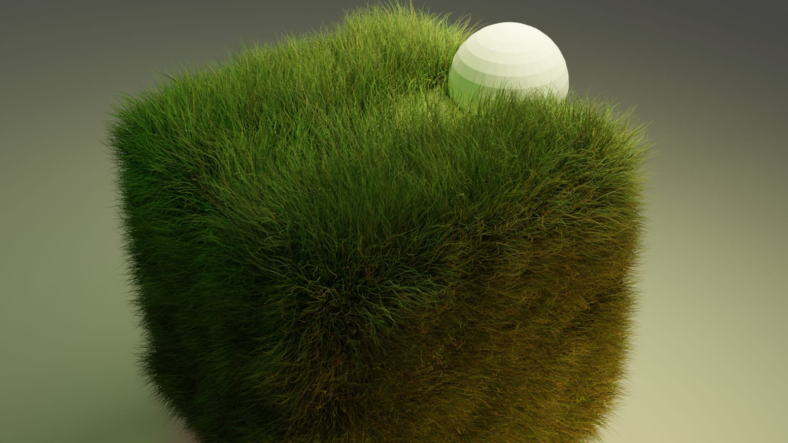

# Blender Creations 🎨🖥️

Welcome to the **Blender** repository! This space contains a few of my works done in Blender, where I explore 3D modeling, rendering, and animation. Here, you can find a video and an illustration that demonstrate some of my creative experiments with Blender.

## Preview 📽️

### Video - **Blendr.mp4**

Take a glimpse of one of my 3D animations!  
Click the video below to watch the magic unfold:

)

---

## Illustration 🌟

Check out this rendered artwork, crafted and designed in Blender:  

---

Feel free to explore the repository and let me know what you think!

## How to View

1. **Video**: Download or view the video by clicking on [Blendr.mp4](Blendr.mp4).
2. **Illustration**: Download the image or view it directly above or via [illustr.jpg](illustr.jpg).

## Tools Used 🛠️
- **Blender** - 3D modeling, animation, and rendering
- **Cycles Render Engine** for photorealistic imagery
- **Creative mind** and endless imagination!

---

> "Art is the only way to run away without leaving home." — Twyla Tharp

---

Enjoy! 😊
